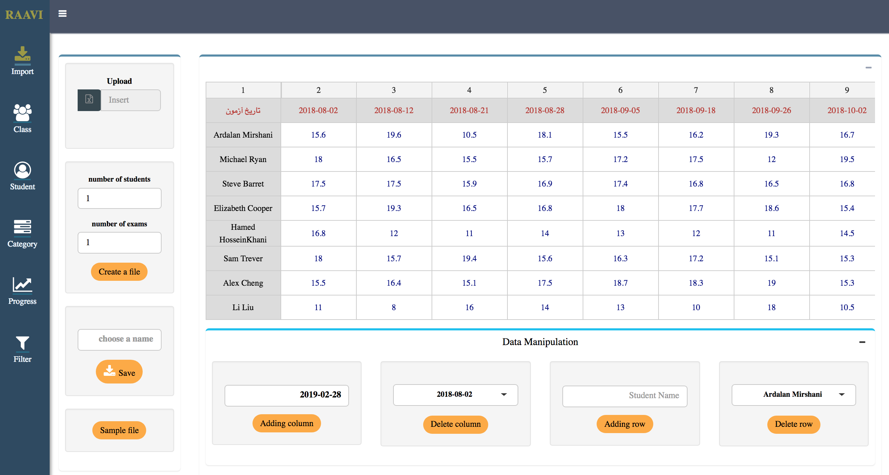

#### Raavi, A shiny app for tracking students and teachers in a class.

  
You can see a [Live demo](http://ardeeshany.shinyapps.io/Raavi_en) of this app here.

&nbsp;

##### Introduction
* * *
**Raavi** (in Farsi means "Story teller") is a modularized shiny web app (interactive web app with back-end in R Statistical language) for tracking the progress of students and teachers in a class over time. It is written in both English and Farsi language. You can access to the English version from the branch "English_Version". RAAVI was a great experience for me on both UI/UX and Server part to build a complicated shiny app. Using many great visualization packages in R like ggplot2, plotly, shinywidgets, rhandsontable, JS packages makes it interesting to look and easy to follow. 

Teachers can import/make their student's scores in the app and use an elementary knowledge of statistics to gain some useful infromation from an exploratory data analysis and download an interactive html version of the results to upload in their websites.

There are six modules in this app :

&nbsp;

#### Module 1 : Import/make data

  

&nbsp;

#### Module 2 : Class progress

  

&nbsp;

#### Module 3 : Student Progress

  

&nbsp;

#### Module 4 : Categorizing students in each exam and over time

  

&nbsp;

#### Module 5 : Progress of group of students

  

&nbsp;

#### Module 6 : Filter

  
